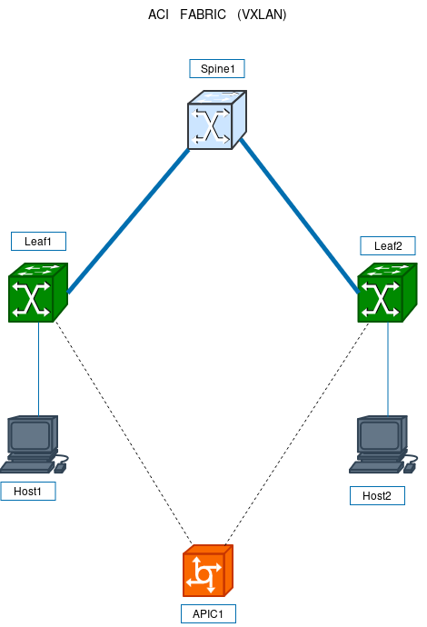

# 🚀 ACI Lab Simulation with VXLAN and Python Automation

## 📌 Overview

This project simulates a modern Data Center network using VXLAN overlay technology, inspired by Cisco ACI architecture.

The lab demonstrates:

* Multi-tenant network segmentation using VXLAN (VNI 10 & 20)
* Underlay and overlay networking
* Microsegmentation using firewall policies (iptables)
* Network automation using Python and SSH

---

## 🏗️ ACI Fabric Topology



This topology represents a basic Cisco ACI fabric with one Spine, two Leafs and endpoints connected to each Leaf.  
The APIC acts as the control plane managing policies and configuration.

---

## 🧠 Architecture

* **Underlay Network:** 10.0.x.x (routing via Kali Linux)
* **Overlay Network:** VXLAN (192.168.x.x)
* **Control Node:** Kali Linux (routing, NAT, automation)
* **Endpoints:**

  * Web Server (10.0.1.10)
  * DB Server (10.0.2.10)

---

## 🔧 Technologies Used

* Linux Networking (iproute2)
* VXLAN
* iptables (firewall & segmentation)
* Python (automation)
* SSH (remote execution)

---

## 🔐 Security & Segmentation

Implemented microsegmentation similar to Cisco ACI contracts:

* Allowed traffic:

  * Web ↔ DB (specific ports)
* Denied:

  * Unauthorized communication between VNIs

---

## 🤖 Automation

Python scripts were used to:

* Deploy VXLAN configurations
* Apply firewall rules
* Execute remote commands via SSH

---

## 📂 Project Structure

```bash
aci_lab/
├── scripts/
│   ├── web_setup.py
│   ├── db_setup.py
│   └── deploy.py
├── diagrams/
├── configs/
└── README.md
```

---

## 🧪 Key Learnings

* VXLAN overlay networking
* Network troubleshooting (routing, NAT, DNS)
* Policy-based segmentation
* Infrastructure automation

---

## 💼 Real-World Relevance

This lab simulates concepts used in:

* Cisco ACI
* Data Center Networking
* Cloud Networking (AWS, Azure)
* DevNet / NetDevOps environments

---

## 🚀 Author

Jaime Rosero Mesa
Senior Network Engineer transitioning into Cybersecurity & Network Automation
